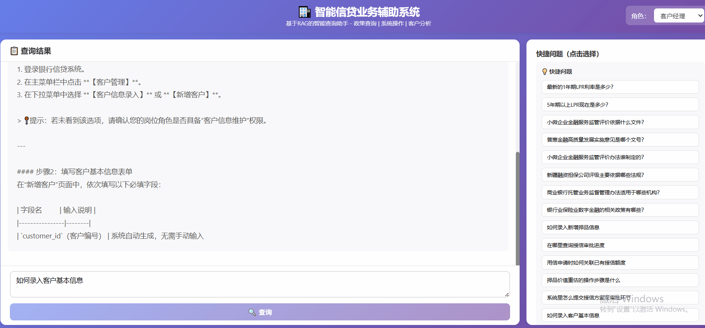

# bank-credit-assistant
项目名称：智能信贷业务辅助系统

一、项目目标：构建一个面向业务人员的智能辅助系统，通过大模型 RAG + 客户预测模块，提升业务人员对政策、系统功能和客户风险的理解与操作效率。

1.帮助业务人员快速查询政策与规则说明

2.提供信贷系统功能与操作指引

3.对客户历史数据进行解释性分析与趋势展示

效果展示：

二、实现方式：本地大模型 + RAG系统 + 预测模型

 - Backend: Python + Flask
 - LLM: Qwen2.5-7B-Instruct/Qwen-max + Qwen3-Embedding 0.6B
 - RAG: Elasticsearch + MySQL
 - OCR/解析: MinerU + PaddleOCR
 - Cache: Redis

三、特性列表
 - 支持监管文件/PDF 结构化解析与向量化检索
 - 多层次上下文记忆（L0-L4），实现高连贯多轮业务对话
 - QA对 + 元数据混合检索，召回率提升至90%以上
 - 大模型流式响应 + Redis 热点缓存，提升响应性能
 - 全链路 Token 监控与动态截断，成本可控

 ---
**Author**: lele  
